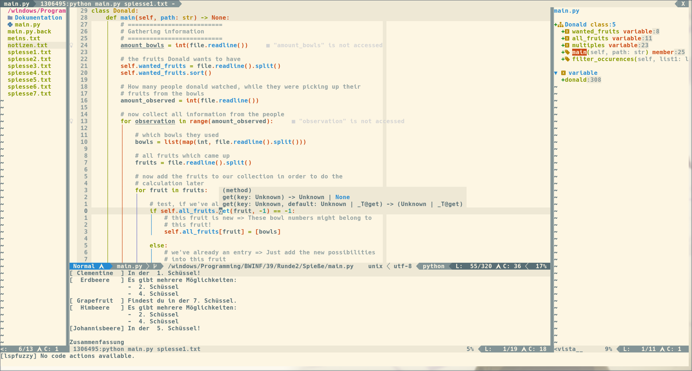

# Screenshot


# Dependencies
- Neovim nightly
- see `:checkhealth`

# Repository structure
```
my_configs
├── autocmds.vim      # Here are my autocommands
├── colors            # Solarized colorschemes
├── colorscheme.vim   # My settings for solarized colorscheme
├── commands.vim      # Some "self"-made commands
├── ftplugin          # Mappings and settings for specific filetypes
├── init.vim          # All Plugins are loaded here and the settings are sourced from the plugins directory
├── lua               # Plugin-settings for lua stuff like LSP
├── mappings.vim      # My mappings which are independent from the plugins
├── plugins           # All settings from almost all plugins I've tried :D
├── README.md         # What you are looking at...
├── Screenshot.png    # The screenshot from the README
└── settings.vim      # All settings for vim
```
